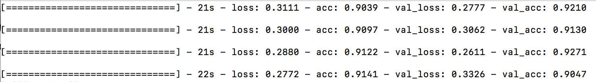
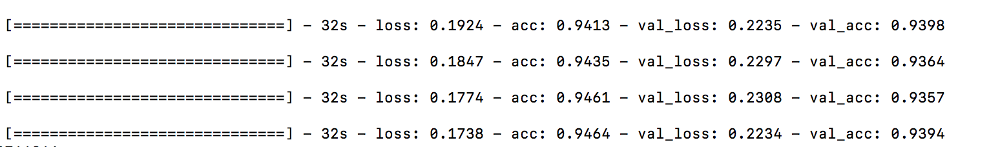

# Training a Convolutional Neural Network on the SVHN Dataset

Problem: Using Keras Sequential interface and a dedicated GPU cluster, training a CNN on the SVHN dataset.

Approach:  On top of base model, batch normalization and other ML methods were applied.
Achieved at least 85% test-set accuracy with a base model.

## Effects of Batch Normalization:
- Without Batch Normalization:

  

- With Batch Normalization:

  

## Data 
- The raw data can be downloaded from : http://ufldl.stanford.edu/housenumbers/

## Files
- main.py includes all the codes for cleaning the data and models.
